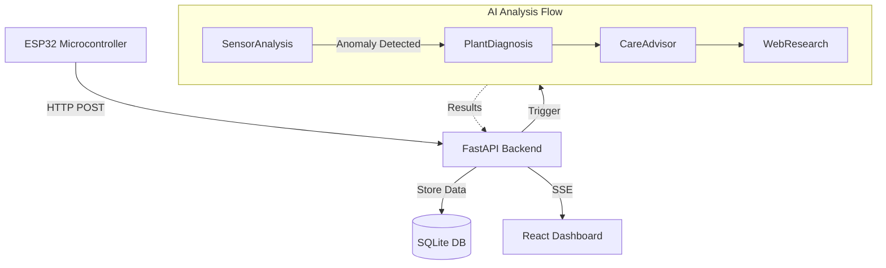
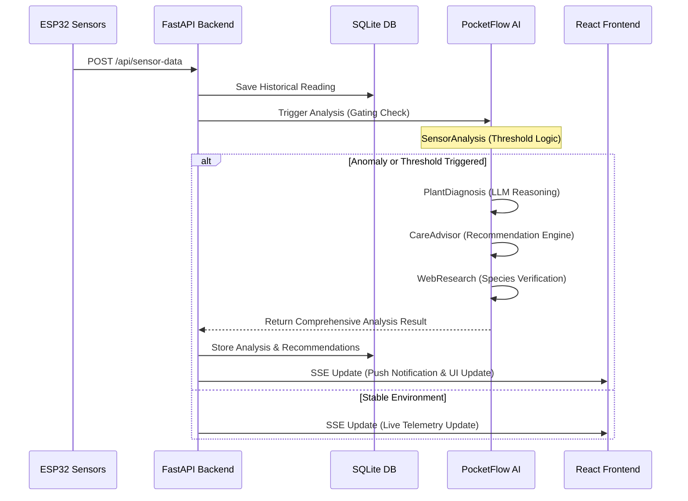

# 🌱 Plant Health Monitoring System


A professional real-time IoT solution for monitoring and diagnosing plant health using ESP32, FastAPI, and specialized AI agents. This system bridges the gap between raw sensor data and expert botanical care advice through a high-performance, multi-agent analysis pipeline.

## 🧠 AI Pipeline

The system features a sophisticated AI analysis pipeline powered by **PocketFlow**, which processes sensor data through four specialized nodes to provide high-fidelity diagnostics. This modular approach allows for complex reasoning while maintaining strict control over computational costs.

1.  **SensorAnalysisNode**: Acts as a rule-based gateway by evaluating incoming telemetry against configurable environmental thresholds. This node ensures that expensive LLM resources are only utilized when sensor readings indicate potential health issues, significant anomalies, or crossed thresholds, effectively minimizing operational overhead.
2.  **PlantDiagnosisNode**: Interprets historical sensor trends and current environmental conditions using advanced LLM reasoning. By correlating metrics like soil moisture, light intensity, temperature, and humidity, it identifies specific health issues such as root rot, acute dehydration, or light-induced stress.
3.  **CareAdvisorNode**: Generates actionable, context-aware care recommendations based on the diagnosed condition. It translates technical findings into specific, easy-to-follow steps for the user, such as adjusting watering schedules, modifying ambient light, or suggesting nutrient supplements.
4.  **WebResearchNode**: Performs real-time web searches via Tavily or DuckDuckGo to retrieve species-specific botanical data. This step validates the AI-generated care advice against up-to-date horticultural databases and ensures that all recommendations are precisely tailored to the specific plant variety being monitored.

## 📡 Architecture

The system is designed with a decoupled architecture, allowing the hardware layer, backend services, and frontend dashboard to scale and evolve independently.



## 📊 Data Flow

The following sequence diagram illustrates the lifecycle of a sensor reading, from the hardware layer through the AI analysis logic and finally to the user's live dashboard via real-time streams.



## ✨ Features

-   🌱 **Real-time Monitoring**: Continuous, high-precision tracking of soil moisture, light levels, temperature, and humidity.
-   🧠 **Intelligent Diagnosis**: A multi-agent AI pipeline that provides professional-grade botanical insights beyond simple alerts.
-   📡 **Live Dashboard**: Instant state updates via Server-Sent Events (SSE) for a highly responsive and fluid monitoring experience.
-   ⚡ **Cost-Efficient Analysis**: Intelligent gating logic prevents unnecessary LLM API calls by filtering stable and healthy sensor data.
-   🐳 **Containerized Deployment**: Full Docker and Docker Compose support for consistent performance across local and production environments.
-   🤖 **Automated Botanical Research**: Integrated web search capabilities to validate care advice against real-world plant databases.
-   📈 **Historical Analytics**: Visualization of plant health metrics over time to identify long-term environmental patterns and seasonal shifts.

## 🛠️ Tech Stack

| Category | Technology |
| :--- | :--- |
| **Backend** | Python 3.11+, FastAPI (v0.1.0), aiosqlite, LiteLLM, PocketFlow, Uvicorn |
| **Frontend** | React 19 (v0.0.0), Vite 7, TypeScript, Tailwind CSS v4, Shadcn UI, Recharts, Framer Motion |
| **Hardware** | ESP32 DevKit, DHT11 (Temperature/Humidity), Capacitive Soil Moisture Sensor, LDR (Light) |
| **Infrastructure** | Docker, Docker Compose, GitHub Actions, GHCR, Vercel |
| **AI/ML** | LiteLLM (OpenRouter/OpenAI/Anthropic), Tavily Search API, DuckDuckGo Search |

## 📂 Project Structure

```text
.
├── .github/
│   └── workflows/
│       └── publish.yml             # CI/CD pipeline for automated GHCR image publishing
├── backend/
│   ├── src/                        # Core application source code
│   │   ├── agents/                 # PocketFlow AI nodes and multi-agent orchestration
│   │   ├── api/                    # FastAPI route definitions and controllers
│   │   ├── utils/                  # Shared utilities (LLM calls, web search, prompts)
│   │   ├── main.py                 # FastAPI app entry point
│   │   ├── config.py               # Configuration and thresholds from env
│   │   ├── db.py                   # SQLite database module (aiosqlite)
│   │   ├── models.py               # Pydantic models for validation
│   │   └── sse.py                  # SSE broadcaster singleton
│   ├── Dockerfile                  # Production container definition
│   ├── pyproject.toml              # Python dependencies (managed with uv)
│   └── seed.py                     # Development seed data script
├── docs/
│   ├── api-reference.md            # Complete API endpoint documentation
│   ├── architecture.md             # System design and mermaid diagrams
│   ├── deployment.md               # Docker, Vercel, and CI/CD deployment guide
│   ├── development.md              # Local development setup guide
│   └── esp32-setup.md              # Hardware wiring, firmware, and calibration
├── firmware/
│   └── plant_health_sensor/
│       └── plant_health_sensor.ino # ESP32 Arduino firmware
├── frontend/
│   ├── src/
│   │   ├── components/             # UI components (SensorCard, AnalysisCard, etc.)
│   │   ├── hooks/                  # Custom hooks (useSensorData, useSSE)
│   │   ├── pages/                  # Dashboard page
│   │   ├── lib/                    # API client functions
│   │   └── App.tsx                 # Root application component
│   └── package.json                # Frontend dependencies and scripts
├── infra/
│   └── docker-compose.yml          # Docker Compose for backend service
├── .env.example                    # Environment variable template
└── README.md
```

## 🚀 Quick Start

### Prerequisites
- Python 3.11 or higher
- Node.js 20 or higher
- [uv](https://github.com/astral-sh/uv) package manager
- Arduino IDE for flashing the firmware

### Backend Setup
```bash
cd backend
uv sync
cp ../.env.example ../.env
# Configure your OPENAI_API_KEY and TAVILY_API_KEY in .env
uv run uvicorn src.main:app --reload
```

### Frontend Setup
```bash
cd frontend
npm install
npm run dev
```

### ESP32 Firmware
1.  Open `firmware/plant_health_sensor/plant_health_sensor.ino` in Arduino IDE.
2.  Install required libraries: `DHT sensor library` (Adafruit) and `ArduinoJson` (Benoit Blanchon).
3.  Update these constants at the top of the file:
    - `WIFI_SSID`: Your WiFi network name.
    - `WIFI_PASSWORD`: Your WiFi password.
    - `BACKEND_URL`: Your backend API endpoint (e.g., `http://192.168.1.100:8000/api/sensor-data`).
4.  Select **ESP32 Dev Module** as your board, pick your port, and click **Upload**.

## 🔌 Hardware Wiring

| Sensor | ESP32 Pin | Type | Notes |
| :--- | :--- | :--- | :--- |
| **DHT11 (Data)** | GPIO 4 | Digital | Requires 10k Pull-up resistor |
| **Soil Moisture** | GPIO 34 | Analog | Use Capacitive sensor for longevity |
| **LDR (Light)** | GPIO 35 | Analog | Use with 10k resistor voltage divider |
| **VCC** | 3.3V | Power | Ensure stable power supply |
| **GND** | GND | Ground | Common ground for all components |

## ⚙️ Environment Variables

The application is configured using environment variables. Ensure you copy `.env.example` to `.env` in the project root before initialization.

| Variable | Description | Default / Example |
| :--- | :--- | :--- |
| `OPENAI_API_KEY` | API key for LLM-powered diagnostics | `sk-...` |
| `TAVILY_API_KEY` | API key for web-based research | `tvly-...` |
| `VITE_BACKEND_URL` | Frontend pointer to the API service | `http://localhost:8000` |
| `DATABASE_PATH` | Path to the SQLite database file | `data/plant_health.db` |
| `SENSOR_INTERVAL_SECONDS` | Delay between sensor telemetry bursts | `60` |
| `SOIL_MOISTURE_LOW` | Threshold for critically dry soil conditions (%) | `20` |
| `SOIL_MOISTURE_HIGH` | Threshold for overwatered soil conditions (%) | `80` |
| `TEMPERATURE_LOW` | Minimum healthy ambient temperature (Celsius) | `15` |
| `TEMPERATURE_HIGH` | Maximum healthy ambient temperature (Celsius) | `35` |
| `HUMIDITY_LOW` | Minimum healthy relative humidity percentage | `30` |
| `HUMIDITY_HIGH` | Maximum healthy relative humidity percentage | `80` |
| `LIGHT_LOW` | Threshold for insufficient light conditions (lux) | `200` |
| `LIGHT_HIGH` | Threshold for excessive direct light exposure (lux) | `50000` |
| `MIN_READINGS_FOR_ANALYSIS` | Number of readings before AI is triggered | `5` |
| `ANALYSIS_COOLDOWN_MINUTES` | Cooldown period between AI analysis sessions | `30` |
| `LLM_MAX_BUDGET` | Maximum cost cap for LLM API usage (USD) | `10.0` |
| `CORS_ORIGINS` | Allowed origins for cross-resource sharing | `http://localhost:5173` |

## 🐳 Docker Deployment

The backend image is published to GHCR with multi-arch support (`linux/amd64`, `linux/arm64`).

```bash
# Pull and run directly
docker pull ghcr.io/moniya03/plant-health/backend:latest
docker run -d -p 8000:8000 --env-file .env -v plant-data:/app/data ghcr.io/moniya03/plant-health/backend:latest

# Or use Docker Compose
cd infra
docker compose up -d
```

-   **Backend Service**: Accessible at `http://localhost:8000`
-   **Persistence**: SQLite database is persisted via a named Docker volume to ensure data safety across restarts.
-   **Updates**: Run `docker compose pull && docker compose up -d` to update to the latest version.

## 🚧 Troubleshooting

-   **ESP32 Connection Issues**: Ensure the `BACKEND_URL` in your `.ino` file uses your computer's local IP address (e.g., `http://192.168.1.50:8000/api/sensor-data`), not `localhost`.
-   **Frontend SSE Errors**: Verify that `CORS_ORIGINS` in your backend `.env` includes the frontend's URL.
-   **AI Analysis Failures**: Check that you have configured a valid `OPENAI_API_KEY` and that your `LLM_MAX_BUDGET` hasn't been exceeded.
-   **Database Locked**: If running multiple instances, ensure only one process is writing to the SQLite database file at a time.

## 🗺️ Roadmap

-   🧪 **Automated Calibration**: ML-driven sensor calibration to account for different soil types.
-   🔔 **Mobile Notifications**: Push notifications via Telegram or Discord for urgent plant care alerts.
-   📸 **Image Analysis**: Integration of computer vision to detect pests and physical leaf damage.
-   🏡 **Multi-Plant Support**: Support for multiple ESP32 nodes connected to a single centralized backend.
-   🔋 **Low Power Mode**: Deep sleep implementation for battery-powered sensor nodes.

## 📖 Documentation

Detailed documentation for each architectural component is available in the `docs/` directory:

- [**Development Guide**](docs/development.md): Detailed coding standards and local testing workflows.
- [**Deployment Instructions**](docs/deployment.md): Cloud hosting, Docker optimization, and production hardening.
- [**ESP32 Setup & Wiring**](docs/esp32-setup.md): Schematic diagrams, pinout maps, and hardware shopping lists.
- [**System Architecture**](docs/architecture.md): Deep dive into the PocketFlow AI multi-agent logic.
- [**API Reference**](docs/api-reference.md): Full endpoint documentation with request/response schemas and curl examples.

## 🤝 Contributing

We welcome community contributions. Whether you are improving the AI agents, adding support for new sensors, or refining the dashboard, please follow these steps:
1.  Fork the repository and create your feature branch.
2.  Ensure your code adheres to the project's linting and formatting standards.
3.  Verify that all backend and frontend tests pass in your local environment.
4.  Submit a pull request with a comprehensive description of your changes and their impact.

## 📜 License

This project is licensed under the MIT License - see the LICENSE file for details.
