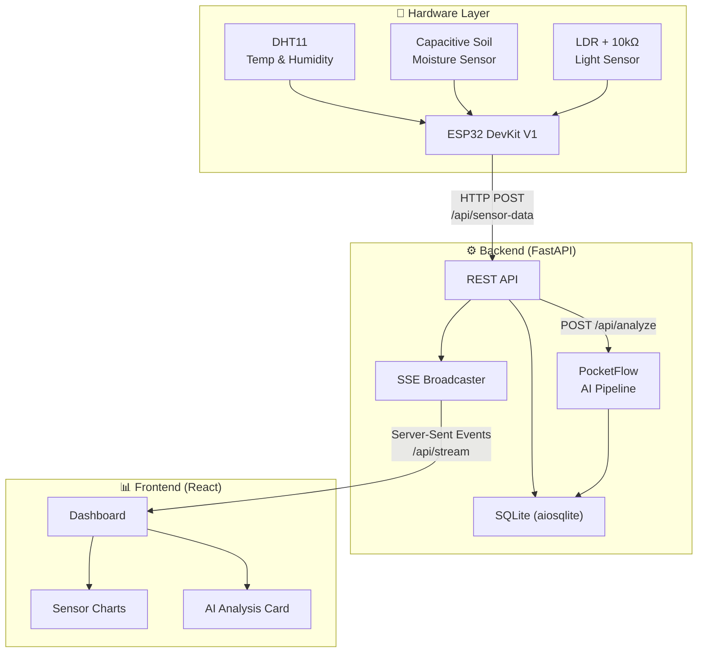
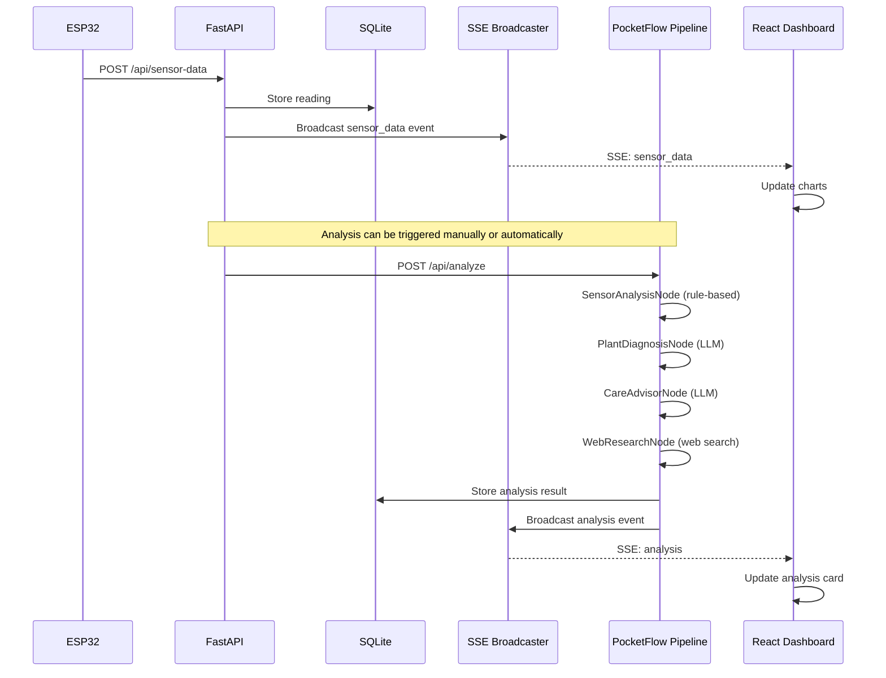
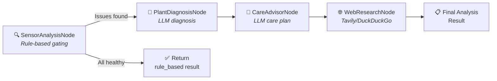
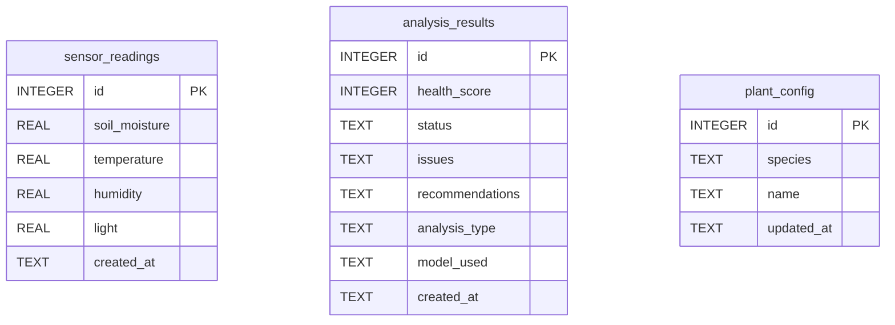

# System Architecture

## 🌐 System Overview
This project uses a 3-tier architecture to monitor and maintain plant health. ESP32 microcontrollers gather real-time data from physical sensors. These readings travel to a FastAPI backend that handles storage, live broadcasting, and AI-driven analysis. A React frontend provides a responsive dashboard for visualization and care recommendations.

## 🏗️ High-Level Architecture Diagram

## 🔄 Data Flow
The sequence below shows how a single sensor reading triggers database updates, real-time broadcasts, and optional AI analysis.

## 🧠 AI Pipeline Architecture
The PocketFlow pipeline consists of four distinct nodes that process sensor data into actionable insights.

1. **SensorAnalysisNode**: This node compares sensor readings against configurable thresholds. If all readings stay within the normal range, it returns a rule_based result to save LLM costs. If it detects issues, the pipeline continues to the next node.
2. **PlantDiagnosisNode**: This node sends sensor data and identified issues to an LLM via LiteLLM. It performs a detailed health diagnosis, considering the specific plant species if one is configured.
3. **CareAdvisorNode**: This node receives the diagnosis and generates specific, actionable care steps using an LLM.
4. **WebResearchNode**: This node searches the web using the Tavily API, with DuckDuckGo as a backup. It finds species-specific care tips to enrich the final recommendations.

## 🗄️ Database Schema
The system uses SQLite with Write-Ahead Logging (WAL) mode to handle concurrent operations efficiently.

- **Issues and recommendations**: Stored as JSON arrays in TEXT columns.
- **Status**: Limited to 'healthy', 'warning', or 'critical'.
- **Analysis type**: Set as 'rule_based', 'ai_routine', or 'ai_critical'.
- **Concurrency**: WAL mode supports simultaneous reads and writes.
- **Location**: Database file stays at `data/plant_health.db` relative to the backend directory.

## 📡 SSE Event Flow
The real-time update mechanism relies on Server-Sent Events (SSE) for efficient data streaming.
- A singleton SSEBroadcaster manages fan-out queues for all connected clients.
- Each client connection receives its own asyncio.Queue.
- The system broadcasts three event types: `sensor_data` for new readings, `analysis` for AI results, and a `ping` every 15 seconds to keep connections alive.
- The frontend uses a custom `useSSE` hook with an EventSource that reconnects automatically if the link drops.
- This in-memory broadcaster requires a single-worker setup since it doesn't share state across multiple processes.

## 🛣️ API Architecture
The backend organizes functionality into five dedicated routers.

| Router | Prefix | Purpose |
| :--- | :--- | :--- |
| sensors | /api/sensor-data | Ingest and query sensor readings |
| analysis | /api/analyze | Trigger and query AI analysis |
| plant | /api/plant | Manage plant species configuration |
| health | /api/health | Check system and database health |
| stream | /api/stream | Provide the SSE event stream |

## 💻 Frontend Architecture
The React application delivers a fast, single-page experience.
- **Data Management**: The `useSensorData` hook fetches historical readings and refreshes every 60 seconds. The `useSSE` hook handles real-time streams.
- **Core Components**:
  - `SensorCard`: Displays individual metrics.
  - `SensorChart`: Visualizes trends using Recharts AreaCharts.
  - `AnalysisCard`: Shows health status with a gauge component.
  - `PlantConfig`: Provides an interface to edit species settings.
  - `ConnectionStatus`: Indicates the current SSE stream state.
- **Styling**: Uses Tailwind v4 with a CSS-first @theme configuration and a custom green-toned plant palette.
- **Motion**: Framer Motion powers staggered animations for a smooth interface.

## 🛠️ Infrastructure
The system is built for easy deployment and containerization.
- **Docker**: The backend runs in a `python:3.12-slim` container using the `uv` package manager for speed.
- **CI/CD**: GitHub Actions handles the build process, pushing images to GHCR whenever the version in `pyproject.toml` changes.
- **Frontend**: The React build is static and deployable to Vercel or similar hosts with SPA rewrite rules.
