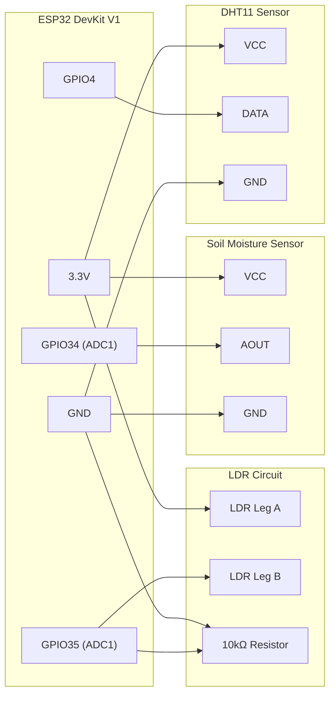

# ESP32 Hardware Setup Guide

Build your plant health sensor node using this hardware manual. It covers everything from parts lists to final testing.

## 📋 Required Components

| Component | Quantity | Description | Approx. Cost |
| :--- | :--- | :--- | :--- |
| ESP32 DevKit V1 (30-pin) | 1 | WiFi-enabled microcontroller | $5-8 |
| DHT11 Sensor Module | 1 | Temperature and humidity sensor (breakout board with 3 pins) | $2-3 |
| Capacitive Soil Moisture Sensor v1.2 | 1 | Corrosion-resistant soil moisture sensor | $2-4 |
| LDR (Photoresistor) | 1 | Light-dependent resistor (5mm) | $0.50 |
| 10kΩ Resistor | 1 | For LDR voltage divider circuit | $0.10 |
| Breadboard | 1 | For prototyping connections | $3-5 |
| Jumper Wires | ~10 | Male-to-male and male-to-female | $2-3 |
| Micro-USB Cable | 1 | For ESP32 power and programming | $2 |

## 🔌 Pin Mapping

Check this table for the physical connections between your sensors and the ESP32 board.

| Sensor | Sensor Pin | ESP32 Pin | ESP32 Label | Signal Type |
| :--- | :--- | :--- | :--- | :--- |
| DHT11 | VCC | 3V3 | 3.3V Power | Power |
| DHT11 | DATA | GPIO4 | IO4 | Digital (one-wire) |
| DHT11 | GND | GND | Ground | Ground |
| Soil Moisture | VCC | 3V3 | 3.3V Power | Power |
| Soil Moisture | AOUT | GPIO34 | IO34 (ADC1_CH6) | Analog |
| Soil Moisture | GND | GND | Ground | Ground |
| LDR (Leg A) | N/A | 3V3 | 3.3V Power | Power |
| LDR (Leg B) + 10kΩ top | N/A | GPIO35 | IO35 (ADC1_CH7) | Analog |
| 10kΩ bottom | N/A | GND | Ground | Ground |

## 📡 Wiring Diagrams

This mermaid flowchart visualizes how all parts link together.



## ⚡ Detailed Wiring Instructions

Set up your connections by following these steps for each module.

### 1. DHT11 Wiring
- Hook up DHT11 VCC to ESP32 3V3.
- Link DHT11 DATA to ESP32 GPIO4.
- Connect DHT11 GND to ESP32 GND.
- Add a 10kΩ pull-up resistor between the DATA and VCC pins if you use a bare 4-pin DHT11 instead of a module.

### 2. Capacitive Soil Moisture Sensor
- Attach the sensor VCC to ESP32 3V3. (CRITICAL: Do not use 5V or you'll fry the ESP32 ADC).
- Wire the sensor AOUT/SIG to ESP32 GPIO34.
- Join the sensor GND to ESP32 GND.

### 3. LDR + Voltage Divider
- Run a jumper from LDR Leg A to ESP32 3V3.
- Connect LDR Leg B to ESP32 GPIO35.
- Link one end of the 10kΩ resistor to the GPIO35 junction.
- Fasten the other end of the resistor to GND.
- Your circuit now has the LDR on the high side and the resistor on the low side.

## 🔧 ASCII Wiring Diagram

```
ESP32 3.3V ──┬──────────── DHT11 VCC
             ├──────────── Soil Moisture VCC  
             └──── LDR Leg A
                     │
                  LDR Leg B
                     │
ESP32 GPIO35 ────────┤
                     │
                  [10kΩ]
                     │
ESP32 GND ───┬───────┴── DHT11 GND
             ├──────────── Soil Moisture GND
             
ESP32 GPIO4  ──────────── DHT11 DATA
ESP32 GPIO34 ──────────── Soil Moisture AOUT
```

## 💡 Important Notes / Gotchas

- Pins GPIO34 and GPIO35 are input-only and lack internal pull resistors, making them ideal for analog data.
- ADC1 channels handle GPIO34 and GPIO35 because ADC2 stops working when WiFi is active.
- Digital communication for DHT11 happens on GPIO4 without interfering with WiFi.
- Capacitive soil sensors require 3.3V power since higher voltages break the ESP32 input.
- Readings from the DHT11 should only happen once per second to avoid errors.
- The 12-bit ADC provides a range from 0 to 4095.
- Higher ADC values signify drier soil for the capacitive sensor.
- Bright light makes the LDR voltage divider output a lower value.

## 🚀 Firmware Setup

1. Install Arduino IDE (2.0+).
2. Add ESP32 board support: File > Preferences > Additional Board Manager URLs: `https://raw.githubusercontent.com/espressif/arduino-esp32/gh-pages/package_esp32_index.json`
3. Open Board Manager, search for "esp32", and install the "ESP32 by Espressif Systems" package.
4. Install libraries via Library Manager: `DHT sensor library` by Adafruit and `ArduinoJson` by Benoit Blanchon.
5. Open `firmware/plant_health_sensor/plant_health_sensor.ino`.
6. Update these constants at the top of the file:
   - `WIFI_SSID`: Your WiFi network name
   - `WIFI_PASSWORD`: Your WiFi password
   - `BACKEND_URL`: Your backend endpoint (e.g., `http://192.168.1.100:8000/api/sensor-data`)
   - `SENSOR_INTERVAL_MS`: Reading interval in milliseconds (default 60000 = 1 minute)
7. Choose "ESP32 Dev Module" from the Tools > Board menu.
8. Pick your ESP32 port under Tools > Port.
9. Click the Upload arrow.
10. Watch the Serial Monitor at 115200 baud for incoming data.

## 📏 Sensor Calibration

- **Soil moisture**: Note the ADC values when the sensor is in water (wet) and air (dry). You can then tweak the mapping in your firmware code.
- **LDR**: Calculations using the 500 / R_ldr formula are just estimates. Use a real light meter if precision matters.
- **DHT11**: Expect occasional read failures. The code skips these automatically using a NaN check.

## 🆘 Troubleshooting

- **DHT failures**: Verify your wiring and check for the pull-up resistor. Ensure you aren't reading the sensor too often.
- **WiFi issues**: Confirm your credentials and make sure you're using 2.4GHz WiFi.
- **Server errors**: Check the `BACKEND_URL`. Confirm the backend app is active.
- **Jumpy readings**: Try adding a 100nF capacitor between the sensor signal and GND.
- **Fixed moisture values**: Look at the 3.3V rail for issues. Make sure the sensor sits properly in the dirt.
